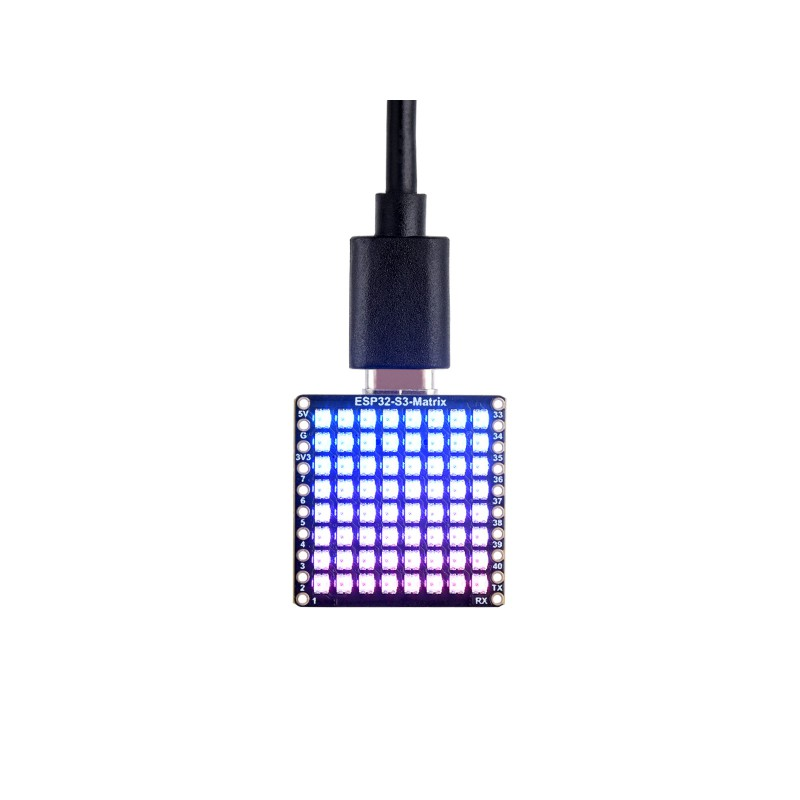

> WIP: After a proper setup is done, it will be documented here. Currently it just hosts an example sketch.

## Future Setup


WIP

## Current setup


[Waveshare esp32-s3 matrix with addresseable LED was used](https://www.waveshare.com/wiki/ESP32-S3-Matrix)




## Important bits for the test setup code

LED Matrix that should receive data from the __Left Canvas__ (aka, Left EYE), edit the below in the code

```c
...
// WiFi& Artnet stuff
const char *ssid = "YOUR_WIFI_SSID";
const char *pwd = "YOUR_WIFI_PWD";

const IPAddress ip(192, 168, 1, 201); // Adjust based on your router's DNS Settings
// const IPAddress ip(192, 168, 1, 202); // Adjust based on your router's DNS Settings; **but give the send setup a diff IP

const IPAddress gateway(192, 168, 1, 1); // Adjust based on your router's DNS Settings
const IPAddress subnet_mask(255, 255, 255, 0);  // Adjust based on your router's DNS Settings

      
int dmxIndex = i * 3;  // For the Left Eye (1st Matrix)
// int dmxIndex = (i * 3) + 192;  // For the Right Eye (2nd Matrix)
```

LED Matrix that should receive data from the __Right Canvas__ (aka, Right EYE), edit the below in the code

```c
...
// WiFi& Artnet stuff
const char *ssid = "YOUR_WIFI_SSID";
const char *pwd = "YOUR_WIFI_PWD";

// const IPAddress ip(192, 168, 1, 201); // Adjust based on your router's DNS Settings
const IPAddress ip(192, 168, 1, 202); // Adjust based on your router's DNS Settings; **but give the send setup a diff IP

const IPAddress gateway(192, 168, 1, 1); // Adjust based on your router's DNS Settings
const IPAddress subnet_mask(255, 255, 255, 0);  // Adjust based on your router's DNS Settings

      
// int dmxIndex = i * 3;  // For the Left Eye (1st Matrix)
int dmxIndex = (i * 3) + 192;  // For the Right Eye (2nd Matrix)
```
