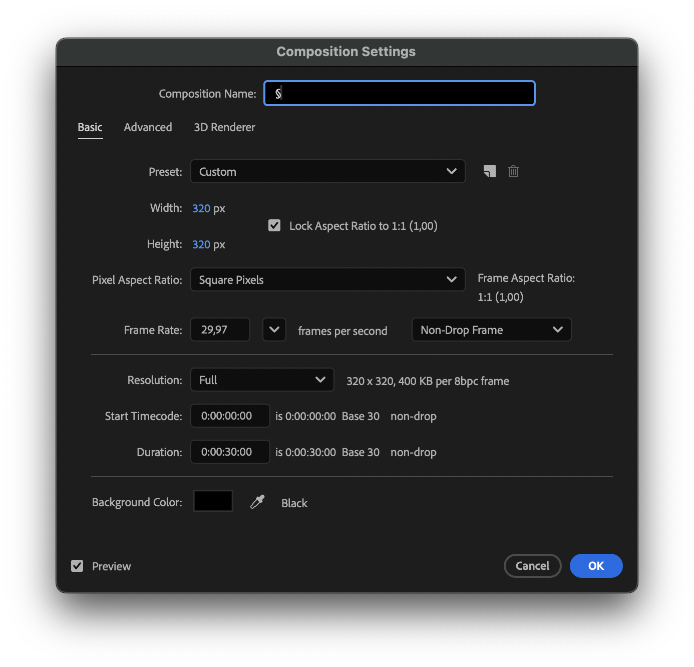

# ArtNet DMX Sender for 2*8x8 addreassable LED matrices - for 🤖 👀

A Processing application for real-time pixelation of media content (images, videos, and Syphon streams) with ArtNet DMX output capabilities. 
> Designed to control 8x8 LED Matrix displays, primarily for humanoid eye animations, but also suitable for other 8x8 pixel mapping projects and visual effects creation.


> The usb cable is only there for providing power to the microcontrollers. The DMX512 ArtNet data is sent over the network.

---

## The inspiration and background


> Oct 2024

During a project exploring future requirements for humanoid design, we investigated necessary affordances and interactions. We recognized that designers needed physical prototypes to experiment with various interaction patterns and communication outputs. [Using a readily available simple Arduino sketch](https://learn.adafruit.com/animating-multiple-led-backpacks?view=all) (we did not have time to make anything fancy), we created an early proof of concept—displaying basic eye movements on a monochrome LED matrix. This physical prototype helped shape our concept visualizations.

> There were many other PoCs but we will use this as a reference for now.

While we lacked time initially, we recognized the future importance of bridging the gap between designers working in familiar software and quickly prototyping physical mockups at their desks to see in relaity how those things may turn up, on the real hardware.

> For example, Disney invests significant effort in creating custom "feature authoring" tools that allows designers and technologists to experiment with various elements like physical animations, sound effects, and light animations.

Having previously used DMX512 and ArtNet to design interactive lighting fixtures for in-car environments and stage designs, I wondered if we could create something similar for humanoid--eyes.

_What if we had software where our animators and visual designers could simply drop in a video file of an eye animation and instantly test it on the actual hardware?_

_Oh and what if you could share/stream your little "triggered animation" from your known software to this platform? That way you don't even have to leave your software suit_ ...

> Those were some of the early questions I started pondering upon and they stayed with me. So, I had to do somethig about it.

## First things first, don't reinvent the wheel

So, I wondered if something like this already existed that I could use. Since I have extensive experience using [Resolume Arena](https://www.resolume.com/) to control LED screens and addressable LED strips, I quickly created a mock-up in Arena to test my hypothesis.


> Circa Feb, 2019, Beijing - Testing content on a custom-resolution flexible LED matrix to evaluate material overlay and LED display quality. The image shows Resolume open for quick matrix display mapping and animation testing.

<br>


> Circa, Feb 2025

## Then reinvent the wheel 😉

Well as good as Resolume is, it is expensive and I needed something a bit more tailored, and leaner - purpose built for my task and also, I just wanted to make it and solve a challenge


---

## How does it work?

### Understanding the requirement


### How is image data mapped from software to the physical matrix?


#### About the hardware


[More in details here](Arduino/README.md)

### How do we downsample an image texture?


---

## Features


> Two videos, loaded and are syncornized.

<br>


> Two different asynchronous sources.
>
> Left: Video Loop.
>
> Right: Graphical textures from another application are sent via Syphon, analyzed (downsampled), and output to ArtNet through our software.

<br>


> Two different asynchronous sources.
>
> Left: Graphical textures from another application are sent via Syphon, analyzed (downsampled), and output to ArtNet through our software.
>
> Right: Graphical textures from another application are sent via Syphon, analyzed (downsampled), and output to ArtNet through our software.

---

__A Note on [Syphon](https://syphon.github.io/)__

> Syphon is an open source Mac OS X technology that allows applications to share frames - full frame rate video or stills - with one another in realtime.

This means that since our application can receive Syphon frames, designers can create interactive animations (like 👀 movements triggered by different inputs) in any compatible software and send frames through Syphon. Our software then does one thing exceptionally well: pixelate and send the data to the LED matrix.

> This decoupling allows the module/middleware to remain flexible, supporting various file and stream formats that can be used in different setups for rapid prototyping.

---

## Want to stream from AfterEffects?

No Problem... 😉 But Mac Only 😂

Make Sure you have [Syphon Transmit](https://github.com/Syphon/Syphon-Transmit) installed for Adobe After Effects (Follow their instructions)

Make sure it's seelected 👇🏼


Then create a composition of `320x320`



Do your magic 🪄 in AE ...

On our middle warte side, in [config.json](Processing/ArtNetSender/config.json) change the server names ...

> OLD config

```json
{
    "syphon": {
        "leftServer": "LeftEye",
        "rightServer": "RightEye"
    }
}
```

> NEW config

```json
{
    "syphon": {
        "leftServer": "Selected Source",
        "rightServer": "Selected Source"
    }
}
```

The Syphon streams from AE appear as: `'After Effects:Selected Source'` where `After Effects:` is the __server source__ and the _value_(here: `Selected Source`) is the __server name__

And then ...


> You can always press 'l' key on your keyboard, for our processing app, to verify the available syphon servers ...

---

## Features (Summary)

- **Multiple Input Sources**

  - Load static images (JPG, PNG, GIF, TIFF, TGA)
    - Drag-and-drop media loading or use the GUI
  - Play videos (MP4, MOV, AVI, WEBM)
    - **Video Synchronization**: Option to sync playback between left and right video streams
  - Capture real-time Syphon streams from other applications - _We will use that for sending eye animations from other softwares, for example ..._
- **Advanced Pixelation**: Four algorithms for different visual effects:
  - Average Color: Smooth, averaged colors for each cell
  - Nearest Neighbor: Crisp, center-sampled colors
  - Threshold: High-contrast black and white
  - Color Quantized: Limited color palette for retro aesthetics
- **ArtNet DMX Output**: Send color data to DMX-controlled lighting fixtures:
  - Broadcast or unicast mode (to a Target IP of a LED matrix controller)
  - Configurable universe and subnet
  - [You can find the Arduino / ESP32 project here for the HW code ..](Arduino/esp32s3_8x8_ledmatrix_artnet_receiver)
- **User-Friendly Interface**
  - Toggle grid and effects with keyboard shortcuts
  - Interactive console with status updates

## System Requirements

- MacOS (Intel or Arm)
- ~~[Windows] Would need SPOUT Implementation - TBD~~

## Installation

1. Install [Processing](https://processing.org/download) - __Processing 4.x recommended for Intel X86 Architecture__
  > As the [Syphon Lib](https://github.com/Syphon/Processing) for Processing has not been ported for ARM Architechture yet. But running a Processing with Intel Architecture will render the things over Rosetta, on any ARM M Series Macs. [Follow this thread](https://github.com/Syphon/Java/issues/7) for more details.
2. Install the required libraries via Processing's Library Manager
   - Sketch > Import Library > Add Library
   - Search for and install: Video, Syphon, ArtNet, ControlP5, Drop
3. Clone or download this repository
4. Open `ArtNetSender.pde` in Processing

## Usage Instructions

### Starting the Application

1. Open `ArtNetSender.pde` in Processing
2. Click the Run button or press Ctrl/Cmd + R
3. The application window will appear with empty canvases

### Loading Media

- **Images/Videos**: Click "Select Left Eye File" or "Select Right Eye File" buttons
- **Drag and Drop**: Drag media files directly onto either canvas
- **Syphon**: Toggle the SYPHON buttons to capture from other applications


### Controls

| Key | Function |
|-----|----------|
| `G` | Toggle grid/pixelation |
| `P` | Cycle through pixelation algorithms |
| `D` | Toggle DMX output |
| `S` | Toggle video synchronization |
| `L` | List available Syphon servers |
| `R` | Reload Syphon clients |
| `BACKSPACE` | Clear media under cursor |
| Mouse click on video | Play/pause video |

### DMX Configuration

1. Set broadcast mode or enter target IP address
2. Configure port (default: 6454)
3. Set subnet and universe values
4. Click "START DMX" to begin transmission

## Pixelation Settings

The application divides each canvas into an 8x8 grid, creating 64 cells per side, with each cell represented by 3 DMX channels (RGB).

- Left canvas: DMX channels 1-192
- Right canvas: DMX channels 193-384

---

## Troubleshooting

### Syphon Issues

- Use the `L` key to list available Syphon servers
- Ensure server names match "LeftEye" and "RightEye"
- Try reloading Syphon with the `R` key
- Confirm your Syphon source is running and publishing

### DMX Problems

- Check network connectivity
- Verify IP address, subnet, and universe settings
- Ensure receiving devices are properly configured
- Check console for error messages

---
